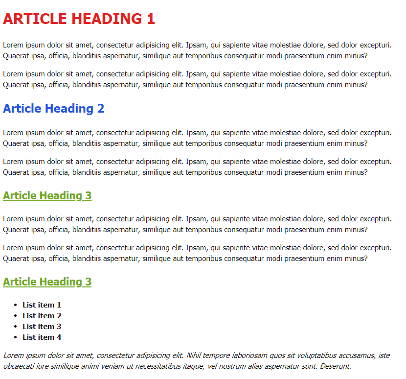

# Свойства для стилизации текста

## Домашнее задание:

1. Создать файл стилей **style.css** и подключить его к документу
2. Задать для тега **body** шрифт Tahoma, sans-serif, цвет текста #121212, размер текста 15px, межстрочный отступ 1.5
3. Задать заголовку **h1** класс **main-title**, поменять цвет текста на #62121, сделать все буквы заглавными, размер текста 30px
4. Заголовкам **h2** задать класс **title**, поменять цвет текста на #2154e6, размер текста 24px
5. Заголовкам **h3** задать класс **small-title**, поменять цвет текста на #71aa1f, размер текста 21рх, сделать текст подчеркнутым снизу
6. Задать списку **ul** класс **list**, поменять "вес" текста на bold
7. В последнем абзаце сделать текст наклонным используя CSS

Результат:

