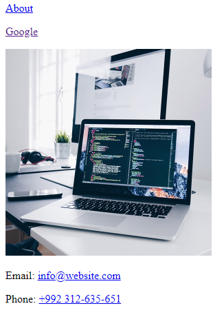

# Изображения и ссылки (img, a)

## Домашнее задание:

1. На странице **index.html** обернуть текст About в ссылку и прописать ссылку на страницу about.html
2. На странице **about.html** обернуть текст Home в ссылку и прописать путь к файлу index.html
3. обернуть **текст Google** в ссылку и прописать ссылку на https://google.com/, ссылка должна открываться в новой
вкладке
4. Вставить изображение из папки **img** со всеми обязательными атрибутами, задать ей размеры 300х300
5. Обернуть **изображение в ссылку** и прописать путь к этому файлу, изображение должно открываться в новой
вкладке
6. Обернуть **e-mail адрес в ссылку** и добавить необходимый протокол в href для него
7. Обернуть **номер телефона в ссылку** и добавить необходимый протокол в href для него

Результат:

