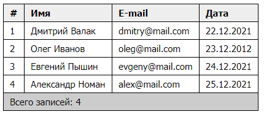

# HTML Таблицы (table, tr, td, th, tbody и др.)

## Домашнее задание:

1. Создать таблицу из **6 строк и 4 колонок**
2. Заполнить таблицу произвольными данными
3. Задать класс **table** для таблицы
4. Первую строку обернуть в **thead** и использовать th для ячеек строки
5. Следующие 4 строки обернуть в **tbody**
6. Последнюю строку обернуть в **tfoot** и объединить все ячейки, чтобы в последней строке была только одна ячейка
7. Выровнять текст в **th** по левому краю
8. Добавить **border** для всех td, th и объединить границы ячеек при помощи **border-collapse**
9. Добавить **внутренний отступ** для th, td слева и справа 10px сверху и снизу 5px
10. Поменять цвет фона у **thead** на #eee
11. Поменять цвет фона у **tfoot** на #ccc

Результат:

